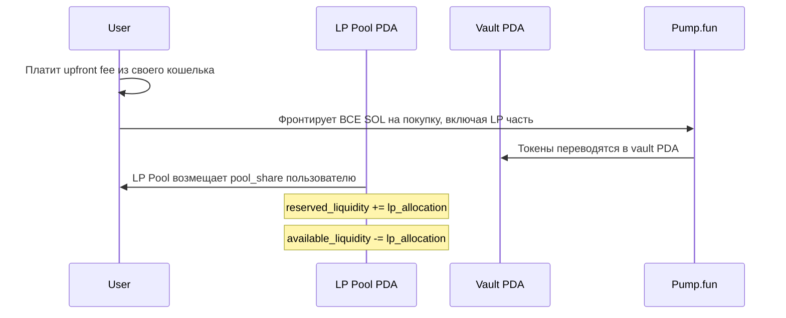
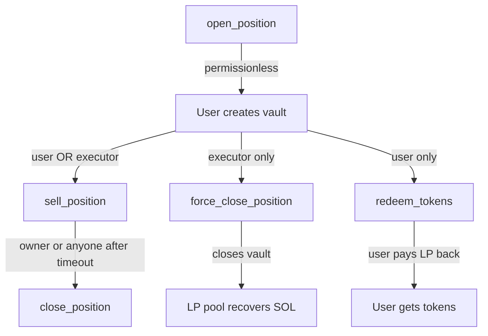

# Анализ: Удаление executor signer из open_position

**Дата**: 2026-03-12  
**Статус**: Рекомендация — **оставить permissionless** с дополнительными guardrails

---

## 1. Текущее состояние после изменения

### Что изменилось

Из инструкции [`open_position`](launch_vault/programs/launch_vault/src/instructions/open_position.rs:19) удалён `executor` signer. Теперь инструкция требует только 2 signer'а:

- `user` — пользователь, который платит fees и вносит `user_contribution`
- `mint` — новый keypair для создания токена на Pump.fun

### Существующие ограничения на open_position

| Проверка | Строка | Описание |
|----------|--------|----------|
| [`protocol_config.status == Active`](launch_vault/programs/launch_vault/src/instructions/open_position.rs:3636 | Протокол должен быть активен |
| [`lp_allocation <= available_liquidity`](launch_vault/programs/launch_vault/src/instructions/open_position.rs:159) | L159 | Достаточно ликвидности в LP pool |
| [`utilization_bps <= max_utilization_bps`](launch_vault/programs/launch_vault/src/instructions/open_position.rs:173) | L173 | Cap утилизации LP pool |
| [`lp_allocation > 0`](launch_vault/programs/launch_vault/src/instructions/open_position.rs:156) | L156 | Не нулевая LP аллокация |
| [`user_contribution > 0`](launch_vault/programs/launch_vault/src/instructions/open_position.rs:157) | L157 | Пользователь вносит свои средства |
| [`total_max_sol <= buy_budget`](launch_vault/programs/launch_vault/src/instructions/open_position.rs:196) | L196 | Бюджет покупок не превышает суммарный |
| Upfront fee оплачивается user | L224-264 | Fees идут из кошелька пользователя |

### Матрица авторизации по инструкциям

| Инструкция | Кто может вызвать | Executor нужен? |
|------------|-------------------|-----------------|
| [`open_position`](launch_vault/programs/launch_vault/src/instructions/open_position.rs:19) | Любой пользователь | ❌ Удалён |
| [`sell_position`](launch_vault/programs/launch_vault/src/instructions/sell_position.rs:11) | vault owner ИЛИ executor | ✅ Опционально |
| [`force_close_position`](launch_vault/programs/launch_vault/src/instructions/force_close_position.rs:11) | Только executor | ✅ Обязательно |
| [`close_position`](launch_vault/programs/launch_vault/src/instructions/close_position.rs:10) | Owner всегда, anyone после timeout | ❌ Не нужен |
| [`redeem_tokens`](launch_vault/programs/launch_vault/src/instructions/redeem_tokens.rs:11) | Только vault owner | ❌ Не нужен |

---

## 2. Анализ безопасности LP pool

### 2.1 Поток средств LP pool при open_position



### 2.2 Ключевое наблюдение — LP pool средства защищены

**Средства LP pool НЕ уходят напрямую в Pump.fun.** Механизм работает так:

1. Пользователь фронтирует **все** SOL для покупки — и свою часть, и LP часть
2. Токены покупаются через buyer PDAs и переводятся в vault PDA — контролируемый программой
3. LP Pool **возмещает** пользователю `pool_share = min(total_sol_spent, lp_allocation)` после покупки — строки [582-586](launch_vault/programs/launch_vault/src/instructions/open_position.rs:582)
4. Купленные токены хранятся в vault PDA — пользователь НЕ получает токены напрямую

### 2.3 Как LP pool получает средства обратно

LP pool возвращает средства через три механизма:

| Сценарий | Инструкция | Что происходит с LP |
|----------|------------|---------------------|
| Продажа токенов | [`sell_position`](launch_vault/programs/launch_vault/src/instructions/sell_position.rs:194) | `pool_recovery = min(sol_received, proportional_lp)` — pool забирает свою долю первым |
| Выкуп токенов | [`redeem_tokens`](launch_vault/programs/launch_vault/src/instructions/redeem_tokens.rs:125) | User платит `proportional_lp` SOL в LP pool + redemption fee |
| Принудительное закрытие | [`force_close_position`](launch_vault/programs/launch_vault/src/instructions/force_close_position.rs:174) | Executor продаёт все токены, SOL идёт в LP pool |

### 2.4 Сценарии злоупотреблений — анализ рисков

#### Сценарий A: «LP drain через массовое открытие позиций»

**Атака**: Злоумышленник открывает множество позиций, исчерпывая LP pool.

**Защита**:
- ✅ `max_utilization_bps` ограничивает суммарную утилизацию, обычно 85%
- ✅ Злоумышленник должен заплатить `user_contribution` + `upfront fee` за каждую позицию — из своего кошелька
- ✅ Каждая позиция создаёт НОВЫЙ токен на Pump.fun — нужен новый mint keypair
- ✅ Токены хранятся в vault PDA, а не у злоумышленника

**Экономическая оценка**: Для drain LP pool на 100 SOL при `fee_bps = 200` злоумышленник заплатит ~2 SOL fees + свои `user_contribution`. Далее ему нужно продать токены `sell_position`, но LP pool забирает свою долю первым из выручки. Злоумышленник в убытке от fees + slippage на Pump.fun.

**Вердикт**: ⚠️ **Низкий риск**. Атака экономически невыгодна. Но есть нюанс — см. Сценарий C.

#### Сценарий B: «Griefing — блокировка LP liquidity»

**Атака**: Злоумышленник открывает позиции и не закрывает их, блокируя reserved_liquidity.

**Защита**:
- ✅ `position_timeout` + [`force_close_position`](launch_vault/programs/launch_vault/src/instructions/force_close_position.rs:102) — executor может принудительно закрыть
- ✅ [`close_position`](launch_vault/programs/launch_vault/src/instructions/close_position.rs:74) — permissionless close после timeout
- ✅ `max_utilization_bps` ограничивает максимальную блокировку

**Вердикт**: ✅ **Риск управляем**. Executor может force_close, timeout обеспечивает permissionless close.

#### Сценарий C: «Манипуляция ценой токена на bonding curve»

**Атака**: Злоумышленник создаёт токен через `open_position` с LP средствами, затем через внешний кошелёк покупает больше на bonding curve, потом вызывает `sell_position` для продажи vault-токенов по завышенной цене.

**Анализ**:
- Пользователь получает `pool_share` SOL от LP pool при открытии позиции
- Потом при `sell_position` LP pool забирает `min(sol_received, proportional_lp)` — свою долю
- Если цена токена выросла, разница свыше proportional_lp остаётся на vault PDA для пользователя
- Если цена упала — LP pool несёт убытки, но это inherent risk протокола при любой модели

**Вердикт**: ⚠️ **Средний риск, но не зависит от наличия executor**. Манипуляция ценой возможна и при keeper модели. LP pool risk — inherent свойство дизайна.

#### Сценарий D: «Спам позициями для увеличения rent costs»

**Атака**: Создание множества позиций для потребления compute units / спама.

**Защита**:
- ✅ Каждая позиция стоит `user_contribution` + fees + rent для vault PDA — минимум ~0.01 SOL
- ✅ Solana transaction fees
- ✅ Каждая позиция создаёт новый токен на Pump.fun — Pump.fun также берёт комиссию

**Вердикт**: ✅ **Низкий риск**. Экономически нецелесообразно.

---

## 3. Permissionless vs Keeper: сравнение моделей

### 3.1 Keeper модель — с executor

| Аспект | Оценка |
|--------|--------|
| **Контроль** | ✅ Полный контроль: executor решает когда/какие позиции открывать |
| **Фильтрация** | ✅ Можно отфильтровать нежелательные параметры на backend |
| **Rate limiting** | ✅ Backend может ограничивать частоту |
| **Centralization** | ❌ Single point of failure, censorship risk |
| **UX** | ❌ User → backend → TX → sign → submit — лишний hop |
| **Latency** | ❌ Двойная задержка: user request + executor processing |
| **Trust** | ❌ Пользователь должен доверять executor |
| **Costs** | ❌ Executor платит gas? Или user + executor оба подписывают? |
| **Liveness** | ❌ Если executor down — протокол не работает |

### 3.2 Permissionless модель — без executor

| Аспект | Оценка |
|--------|--------|
| **Децентрализация** | ✅ Нет single point of failure |
| **UX** | ✅ Простой: user подписывает → TX on-chain |
| **Latency** | ✅ Минимальная: одна транзакция |
| **Composability** | ✅ Другие протоколы могут интегрировать open_position |
| **Trust** | ✅ Trustless — on-chain правила определяют всё |
| **Контроль** | ⚠️ Ограничен on-chain параметрами: utilization cap, fees |
| **Фильтрация** | ⚠️ Нет off-chain фильтрации |
| **Спам** | ⚠️ Экономические барьеры, но нет rate limiting |

---

## 4. Консистентность с другими инструкциями

### 4.1 Текущая модель авторизации



### 4.2 Оценка консистентности

**Логика непротиворечива**:

1. **open_position** — permissionless: пользователь рискует своим `user_contribution` + fees. LP pool защищён utilization cap и тем, что токены хранятся в vault PDA.

2. **sell_position** — user OR executor: Логично. Пользователь может сам продать, executor может продать для risk management — особенно при stop-loss. Это `OR`, не `AND`.

3. **force_close_position** — executor only: Правильно. Это аварийный механизм. Продаёт с `min_sol_output = 0`. Только доверенная сторона должна иметь такие полномочия.

4. **close_position** — owner always, anyone after timeout: Permissionless close после timeout — стандартный DeFi паттерн.

5. **redeem_tokens** — user only: Пользователь платит SOL обратно в LP pool, получает токены. Только owner имеет мотивацию.

**Вывод**: ✅ Модель консистентна. Executor сохранён там, где нужен — для risk management и аварийного закрытия.

---

## 5. Рекомендация

### Вердикт: **Оставить permissionless open_position**

Удаление executor из `open_position` — **правильное архитектурное решение** по следующим причинам:

### 5.1 Почему permissionless — правильный выбор

1. **LP pool средства защищены on-chain**: utilization cap, upfront fees, токены в vault PDA
2. **Экономические барьеры**: user_contribution + fees делают злоупотребление невыгодным
3. **Executor сохранён для risk management**: force_close и sell_position по-прежнему доступны executor'у
4. **UX улучшается**: одна транзакция вместо двух
5. **Нет single point of failure**: протокол работает даже если backend down
6. **DeFi best practice**: lending протоколы, AMMs — все permissionless для открытия позиций

### 5.2 Рекомендуемые дополнительные guardrails

Хотя текущие ограничения достаточны, рекомендуется рассмотреть:

| # | Guardrail | Приоритет | Описание |
|---|-----------|-----------|----------|
| 1 | **Минимальный user_contribution** | Высокий | Добавить `min_user_contribution` в `ProtocolConfig`. Сейчас проверяется только `> 0`, что позволяет `user_contribution = 1 lamport`. |
| 2 | **Максимальный lp_allocation per position** | Средний | Добавить `max_lp_per_position` в `ProtocolConfig`. Сейчас один пользователь может взять всю доступную ликвидность в одной позиции. |
| 3 | **Максимальное количество позиций на пользователя** | Низкий | Counter в отдельном PDA. Защита от спама, но усложняет архитектуру. |
| 4 | **Cooldown между позициями** | Низкий | Timestamp-based rate limiting on-chain. Защита от спама. |

### 5.3 Критический guardrail — минимальный user_contribution

Сейчас пользователь может открыть позицию с `user_contribution = 1 lamport` и `lp_allocation = 10 SOL`. Это означает, что LP pool несёт 99.99% риска, а пользователь — 0.01%.

**Рекомендация**: Добавить в [`ProtocolConfig`](launch_vault/programs/launch_vault/src/state/protocol_config.rs:11) поле:

```rust
/// Minimum user contribution per position in lamports
pub min_user_contribution: u64,

/// Maximum LP allocation per position in lamports
pub max_lp_per_position: u64,

/// Minimum ratio of user_contribution to lp_allocation in basis points
/// e.g., 2000 = user must contribute at least 20% of lp_allocation
pub min_user_ratio_bps: u16,
```

И добавить проверку в `open_position`:

```rust
require!(
    user_contribution >= protocol_config.min_user_contribution,
    LaunchVaultError::UserContributionTooLow
);
require!(
    lp_allocation <= protocol_config.max_lp_per_position,
    LaunchVaultError::LpAllocationTooHigh
);
let user_ratio_bps = (user_contribution as u128)
    .checked_mul(10_000)
    .unwrap()
    .checked_div(lp_allocation as u128)
    .unwrap() as u16;
require!(
    user_ratio_bps >= protocol_config.min_user_ratio_bps,
    LaunchVaultError::InsufficientUserRatio
);
```

---

## 6. Резюме

| Вопрос | Ответ |
|--------|-------|
| Вернуть executor? | ❌ Нет |
| Оставить permissionless? | ✅ Да |
| Гибридный подход? | Не требуется — текущая архитектура уже гибридная: open = permissionless, risk management = executor |
| Дополнительные guardrails? | ✅ Добавить min_user_contribution, max_lp_per_position, min_user_ratio_bps |
| Консистентность с другими инструкциями? | ✅ Да — executor сохранён в sell/force_close |

**Итого**: Permissionless `open_position` — это правильное решение, улучшающее UX и устраняющее centralized dependency. LP pool защищён on-chain ограничениями. Единственное необходимое усиление — добавить минимальные пороги для `user_contribution` относительно `lp_allocation`, чтобы пользователь имел достаточный skin in the game.
