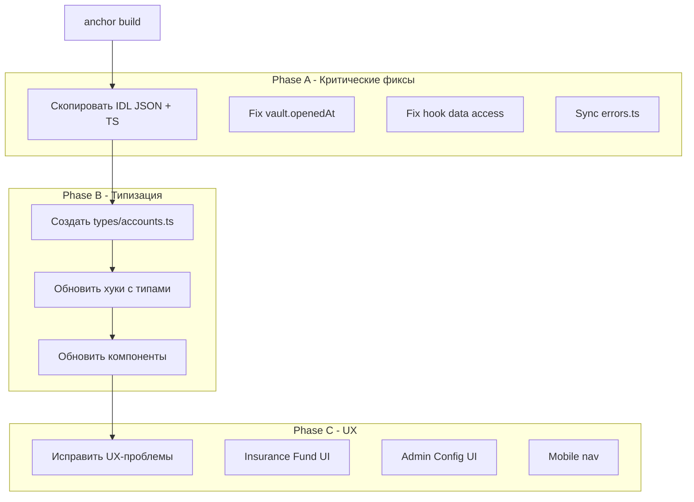

# План доработки фронтенда MiMi Protocol

## Обнаруженные проблемы

### 1. Рассинхронизация полей IDL ↔ Контракт ↔ Компоненты

| Файл | Проблема |
|------|----------|
| `VaultDetail.tsx:78` | `vault.openedAt` → должно быть `vault.openTimestamp` (поле в IDL: `openTimestamp`) |
| `ProtocolStats.tsx:66-67` | `config!.data` / `pool!.data` — хуки `useProtocolConfig` и `useLpPool` возвращают `{ address, data }`, но компонент обращается к `config!.data` без защиты |
| `LaunchBundleForm.tsx:79-80` | `(config as any).fixedFee` — хук возвращает `{ address, data }`, а обращение идёт напрямую к `config` без `.data` |
| `LaunchBundleForm.tsx:85` | `(pool as any).availableLiquidity` — аналогично, нужно `pool.data.availableLiquidity` |

### 2. Повсеместное `as any` — отсутствие типизации

33 использования `as any` по всему фронтенду. Причина — Anchor v0.32 генерирует IDL с типами, но `program.account.launchVaultState` и `.protocolConfig` не имеют типов через generic-параметр `Program<LaunchVault>`.

**Затронутые файлы:**
- `VaultDetail.tsx` — 3 вхождения
- `ProtocolStats.tsx` — 10 вхождений
- `LaunchBundleForm.tsx` — 3 вхождения
- `RedeemForm.tsx` — 1 вхождение
- `admin/page.tsx` — 3 вхождения
- `transactions.ts` — 6 вхождений (accounts `as any`)
- `hooks/*.ts` — 3 вхождения

### 3. Несогласованность данных между хуками и компонентами

| Хук | Возвращает | Использование в компонентах |
|-----|-----------|---------------------------|
| `useProtocolConfig()` | `{ address, data }` | `LaunchBundleForm` обращается как `config.fixedFee` (без `.data`) |
| `useLpPool()` | `{ address, data }` | `LaunchBundleForm` обращается как `pool.availableLiquidity` (без `.data`) |
| `useProtocolConfig()` | `{ address, data }` | `ProtocolStats` правильно использует `config!.data` |

### 4. Ошибки в error map

| Код | В `errors.ts` | В контракте `errors.rs` |
|-----|--------------|----------------------|
| 6014 | "LP allocation must be > 0" | `ZeroLpAllocation` ✓ |
| 6015 | "User contribution must be > 0" | `ZeroUserContribution` ✓ |

Маппинг кодов **корректен** (33 ошибки, 6000-6032). Сообщения немного отличаются от контракта, но функционально эквивалентны.

### 5. UX/функциональные проблемы

1. **VaultList** — ссылка "Create your first vault" ведёт на `/vault/create`, но основной flow — `/launch` (Open Position)
2. **VaultDetail** — `handleClosePosition` не передаёт `tokenMint` при вызове, а `buildClosePosition` не использует его
3. **Admin page** — нет UI для `updateProtocolConfig` (функция есть в `transactions.ts`, но нет формы)
4. **Нет отображения Insurance Fund** — данные есть в контракте, но нет в UI
5. **Navbar** — нет мобильной навигации (бургер-меню)
6. **ClusterProvider** — переключение devnet/mainnet через localStorage без валидации RPC endpoint

---

## План действий

### Phase A: Критические фиксы синхронизации

1. **Исправить `vault.openedAt` → `vault.openTimestamp`** в `VaultDetail.tsx:78`
2. **Исправить обращение к данным хуков** в `LaunchBundleForm.tsx`:
   - `config.fixedFee` → `config.data.fixedFee` (или исправить хук)
   - `pool.availableLiquidity` → `pool.data.availableLiquidity`
3. **Пересобрать IDL** — выполнить `anchor build`, скопировать `target/idl/launch_vault.json` и `target/types/launch_vault.ts` в `app/web/src/lib/idl/`
4. **Обновить `errors.ts`** — синхронизировать тексты ошибок с контрактом

### Phase B: Типизация — убрать `as any`

5. **Создать TypeScript интерфейсы** для account state:
   - `ProtocolConfig` interface
   - `LpPool` interface
   - `LaunchVaultState` interface
   - `InsuranceFund` interface
   - `VaultStatus` enum type
   - `ProtocolStatus` enum type
6. **Типизировать хуки** — `useProtocolConfig`, `useLpPool`, `useUserVaults`, `useAllVaults`
7. **Типизировать компоненты** — убрать `as any` из props и обращений к данным
8. **Типизировать accounts в `transactions.ts`** — вместо `as any` использовать корректные маппинги

### Phase C: UX-улучшения

9. **Исправить ссылку в VaultList** — `/vault/create` → `/launch`
10. **Добавить Insurance Fund в ProtocolStats** — показать `total_sol` и адрес
11. **Добавить Update Protocol Config UI в Admin** — форма для обновления параметров протокола
12. **Мобильная навигация** — добавить бургер-меню в Navbar
13. **Валидация при Open Position** — проверка `totalMaxSol <= totalBuyBudget` перед отправкой
14. **Подключить cluster из ClusterProvider** к `explorerUrl` и `explorerAccountUrl` — сейчас hardcoded `devnet`

---

## Архитектура изменений

## Файлы для изменения

| Файл | Phase | Изменения |
|------|-------|-----------|
| `lib/idl/launch_vault.json` | A | Пересобрать из контракта |
| `lib/idl/launch_vault.ts` | A | Пересобрать из контракта |
| `components/vault/VaultDetail.tsx` | A+B | Fix `openedAt`, типизация |
| `components/launch/LaunchBundleForm.tsx` | A+B+C | Fix data access, типизация, валидация |
| `lib/errors.ts` | A | Синхронизация текстов |
| `lib/types.ts` *(новый)* | B | TypeScript интерфейсы account state |
| `hooks/useProtocolConfig.ts` | B | Типизация return |
| `hooks/useLpPool.ts` | B | Типизация return |
| `hooks/useUserVaults.ts` | B | Типизация return |
| `hooks/useAllVaults.ts` | B | Типизация return |
| `components/protocol/ProtocolStats.tsx` | B+C | Типизация + Insurance Fund |
| `components/vault/VaultList.tsx` | C | Fix link |
| `components/layout/Navbar.tsx` | C | Mobile nav |
| `app/admin/page.tsx` | B+C | Типизация + Config UI |
| `lib/transactions.ts` | B | Убрать `as any` |
| `lib/format.ts` | C | Cluster-aware explorer URLs |
