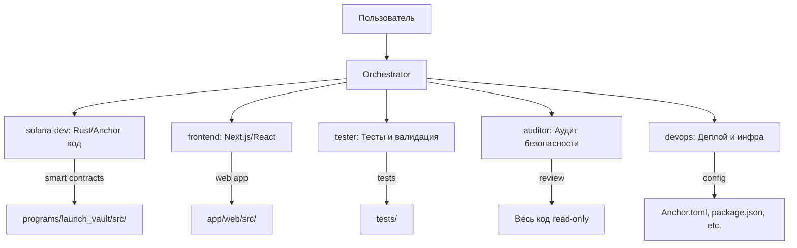

# План: Мульти-агентная система для MiMi Protocol

## Концепция

Настроить в Kilo Code набор специализированных агентов (кастомных режимов), каждый из которых отвечает за свою область проекта. Агенты координируются через встроенный **Orchestrator** режим, который разбивает сложные задачи на подзадачи и делегирует их нужному агенту.

## Как это работает

## Агенты-режимы

### 1. `solana-dev` — Solana/Anchor разработчик
- **Зона ответственности**: Rust код программы, инструкции, CPI, state, ошибки, события
- **Файлы для редактирования**: `*.rs`, `Cargo.toml`, `Cargo.lock`
- **Когда использовать**: Написание/изменение смарт-контрактов, добавление инструкций, работа с PDA, CPI к Pump.fun
- **Инструменты**: read, edit, command (anchor build/test)

### 2. `frontend` — Frontend разработчик  
- **Зона ответственности**: Next.js приложение, React компоненты, хуки, провайдеры
- **Файлы для редактирования**: `*.tsx`, `*.ts`, `*.css`, `*.json` (внутри app/web/)
- **Когда использовать**: UI компоненты, интеграция с программой через IDL, wallet adapter
- **Инструменты**: read, edit, command (npm), browser

### 3. `tester` — Тестировщик
- **Зона ответственности**: Написание и запуск тестов, валидация сценариев
- **Файлы для редактирования**: `*.ts` в tests/, тестовые скрипты
- **Когда использовать**: Написание тестов, проверка инвариантов LP pool, тестирование CPI
- **Инструменты**: read, edit, command (anchor test)

### 4. `auditor` — Аудитор безопасности
- **Зона ответственности**: Ревью кода на уязвимости, проверка accounting logic, access control
- **Файлы для редактирования**: только `*.md` (отчёты аудита)
- **Когда использовать**: Перед деплоем, после крупных изменений, проверка CPI безопасности
- **Инструменты**: read, edit (только .md)

### 5. `devops` — DevOps / Деплой
- **Зона ответственности**: Конфигурация деплоя, Anchor.toml, миграции, CI/CD
- **Файлы для редактирования**: конфиги, миграции, скрипты деплоя
- **Когда использовать**: Деплой на devnet/mainnet, настройка окружения, управление ключами
- **Инструменты**: read, edit, command

## Пример рабочего процесса

**Задача**: "Добавить Phase 1 stop-loss функциональность"

1. Пользователь даёт задачу **Orchestrator**
2. Orchestrator разбивает на подзадачи:
   - → `solana-dev`: Написать инструкцию stop_loss.rs, обновить state
   - → `tester`: Написать тесты для stop-loss сценариев
   - → `frontend`: Добавить UI для настройки stop-loss
   - → `auditor`: Проревьюить stop-loss на уязвимости
   - → `devops`: Задеплоить обновлённую программу на devnet
3. Каждый агент работает в своей зоне, не трогая чужие файлы

## Файлы, которые нужно создать

1. **`.kilocodemodes`** — конфигурация всех кастомных режимов (YAML)
2. **`plans/multi-agent-plan.md`** — этот документ (уже создан)

## Ключевые принципы

- **Изоляция**: каждый агент редактирует только свои файлы через `fileRegex`
- **Координация**: Orchestrator знает про все режимы через `whenToUse`
- **Контекст**: каждый агент имеет в `roleDefinition` знания о MiMi Protocol
- **Read доступ**: все агенты могут читать любые файлы проекта
